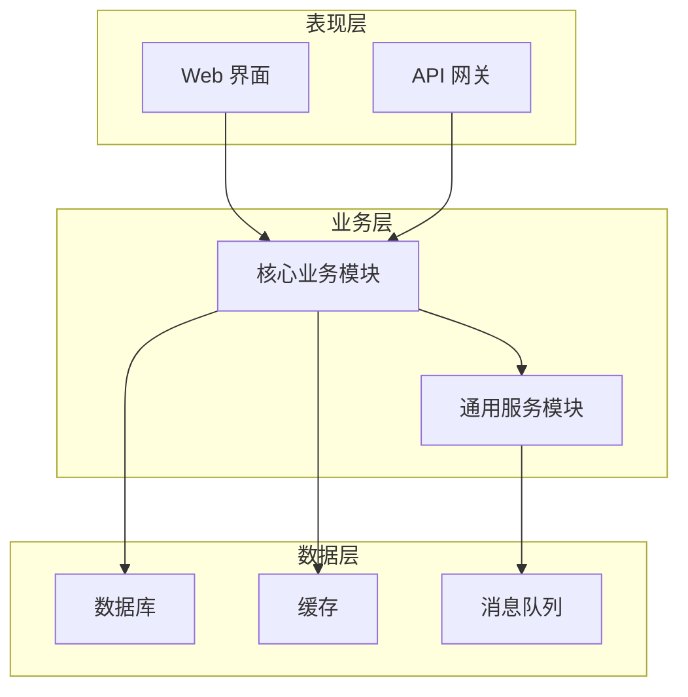
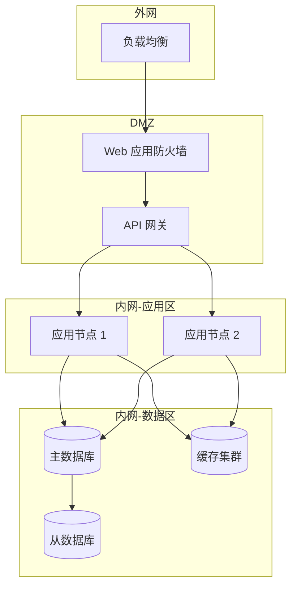
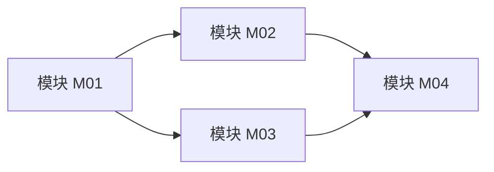
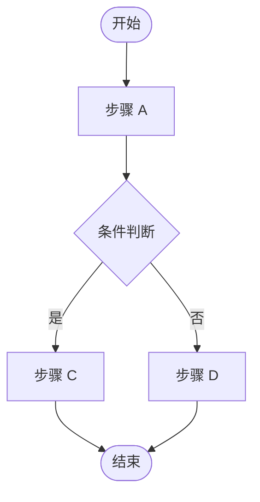
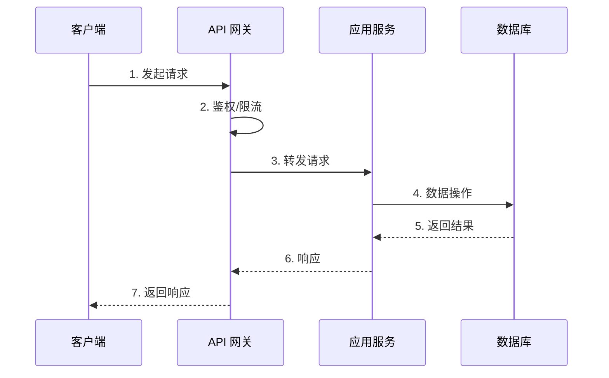
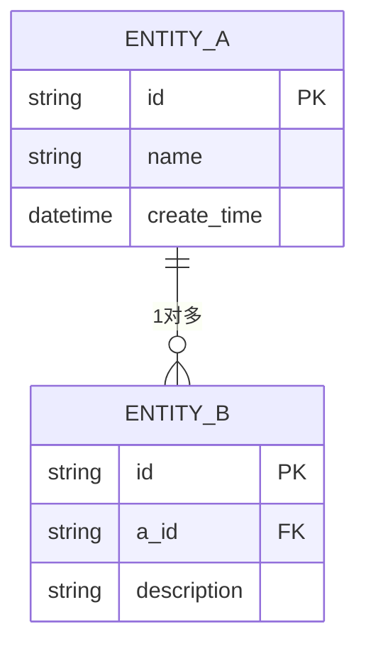

# 概要设计文档

> **文档编号**: DOC-HLD-001
> **版本**: V1.0
> **状态**: [ ] 草稿  [ ] 评审中  [ ] 定稿
> **作者**: ___________
> **日期**: ___________

---

## 文档修订记录

| 版本 | 日期 | 修改人 | 修改内容 |
| --- | --- | --- | --- |
| V1.0 | | | 初稿 |

---

## 1. 引言

### 1.1 编写目的

> **[必有项]** 说明本概要设计文档的编写目的、预期读者.

本文档描述 ______ 系统的概要设计, 面向项目经理、架构师、开发工程师和测试工程师.
读者通过本文档可理解系统整体架构、模块划分、接口关系和关键技术选型.

### 1.2 项目背景

> **[必有项]** 说明项目的业务背景、建设目标和约束条件.

### 1.3 术语与缩略语

| 术语 | 全称 | 说明 |
| --- | --- | --- |
| | | |

### 1.4 参考文档

| 序号 | 文档名称 | 版本 | 来源 |
| --- | --- | --- | --- |
| 1 | 需求规格说明书 | | |
| 2 | 接口协议文档 | | |

---

## 2. 系统总体设计

### 2.1 设计目标

> **[必有项]** 列出系统设计的核心目标 (功能目标 + 非功能目标).

| 类别 | 目标 | 衡量标准 |
| --- | --- | --- |
| 功能 | | |
| 性能 | | |
| 可用性 | | |
| 安全性 | | |
| 可扩展性 | | |

### 2.2 设计原则

> **[必有项]** 遵循的设计原则 (如分层解耦、单一职责、开闭原则等).

### 2.3 约束条件

| 类别 | 约束 | 说明 |
| --- | --- | --- |
| 技术 | | |
| 业务 | | |
| 合规 | | |

---

## 3. 系统架构

### 3.1 总体架构图

> **[必有项]** 系统总体架构图, 展示分层关系和模块组成.



### 3.2 技术架构

> **[必有项]** 技术选型表.

| 层次 | 技术选型 | 版本 | 选型理由 |
| --- | --- | --- | --- |
| 开发语言 | | | |
| Web 框架 | | | |
| 数据库 | | | |
| 缓存 | | | |
| 消息队列 | | | |
| 部署 | | | |

### 3.3 部署架构

> **[必有项]** 部署拓扑图, 展示网络分区、负载均衡、容灾.



---

## 4. 模块设计

### 4.1 模块划分

> **[必有项]** 模块清单, 含职责说明.

| 模块编号 | 模块名称 | 职责 | 依赖模块 | 优先级 |
| --- | --- | --- | --- | --- |
| M01 | | | | P0 |
| M02 | | | | P0 |
| M03 | | | | P1 |

### 4.2 模块关系图

> **[必有项]** 模块间依赖关系图.



### 4.3 核心模块说明

#### 4.3.1 模块 M01: ______

| 项目 | 说明 |
| --- | --- |
| 模块编号 | M01 |
| 模块名称 | |
| 模块职责 | |
| 输入 | |
| 输出 | |
| 核心流程 | 见 4.3.1.1 流程图 |
| 异常处理 | |
| 性能要求 | |

##### 4.3.1.1 核心流程图

> **[必有项]** 该模块的核心业务流程图.



---

## 5. 接口设计

### 5.1 接口清单

> **[必有项]** 系统对外接口和模块间接口清单.

| 接口编号 | 接口名称 | 类型 | 提供方 | 消费方 | 协议 |
| --- | --- | --- | --- | --- | --- |
| IF-001 | | 同步/异步 | | | HTTP/gRPC |
| IF-002 | | | | | |

### 5.2 接口交互时序图

> **[必有项]** 核心接口交互时序图.



### 5.3 接口规范

> **[必有项]** 接口定义模板 (每个接口填写).

#### 接口 IF-001: ______

| 项目 | 说明 |
| --- | --- |
| 接口名称 | |
| 请求方式 | GET / POST / PUT / DELETE |
| 请求路径 | |
| 请求头 | |
| 请求参数 | 见下表 |
| 响应格式 | JSON |
| 状态码 | 200 / 400 / 500 |

**请求参数:**

| 参数名 | 类型 | 必填 | 说明 | 示例 |
| --- | --- | --- | --- | --- |
| | string/int | 是/否 | | |

**响应示例:**

```json
{
    "code": 1,
    "msg": "请求成功",
    "data": {}
}
```

---

## 6. 数据库设计

### 6.1 数据库选型

| 用途 | 数据库 | 版本 | 说明 |
| --- | --- | --- | --- |

### 6.2 ER 图

> **[必有项]** 实体关系图 (如无数据库可删除本节).



### 6.3 核心表设计

> **[必有项]** 核心数据表结构.

#### 表: ______

| 字段名 | 类型 | 主键/索引 | 允许空 | 默认值 | 说明 |
| --- | --- | --- | --- | --- | --- |
| id | bigint | PK | 否 | | 主键 |
| create_time | datetime | INDEX | 否 | CURRENT_TIMESTAMP | 创建时间 |

---

## 7. 非功能性设计

### 7.1 性能设计

> **[必有项]** 性能指标和设计保障.

| 指标 | 目标值 | 设计保障 |
| --- | --- | --- |
| 响应时间 (P99) | < ___ ms | |
| 吞吐量 (QPS) | > ___ | |
| 并发用户数 | ___ | |
| 数据量 | ___ | |

### 7.2 可用性设计

| 指标 | 目标值 | 设计保障 |
| --- | --- | --- |
| 系统可用性 | 99.9% | |
| 故障恢复时间 (RTO) | < ___ min | |
| 数据恢复点 (RPO) | < ___ min | |

### 7.3 安全设计

> **[必有项]** 认证授权、数据加密、审计日志.

| 安全维度 | 设计方案 |
| --- | --- |
| 身份认证 | |
| 权限控制 | |
| 数据传输 | HTTPS / TLS |
| 数据存储 | |
| 审计日志 | |

### 7.4 可扩展性设计

| 维度 | 扩展方案 |
| --- | --- |
| 水平扩展 | |
| 垂直扩展 | |
| 数据分片 | |

### 7.5 可维护性设计

| 维度 | 设计方案 |
| --- | --- |
| 日志规范 | |
| 监控告警 | |
| 配置管理 | |
| CI/CD | |

---

## 8. 部署与运维

### 8.1 环境规划

> **[必有项]** 各环境配置说明.

| 环境 | 用途 | 配置 | 数据 |
| --- | --- | --- | --- |
| 开发 (DEV) | 日常开发 | 最小配置 | Mock 数据 |
| 测试 (TEST) | 功能测试 | | 测试数据 |
| 预发 (UAT) | 准生产验证 | | 脱敏数据 |
| 生产 (PROD) | 正式运行 | | 生产数据 |

### 8.2 部署清单

> **[必有项]** 部署组件清单.

| 组件 | 镜像/包 | 端口 | 依赖 | 资源限制 |
| --- | --- | --- | --- | --- |
| | | | | CPU: __ / 内存: __ |

### 8.3 监控告警

| 监控项 | 阈值 | 告警方式 | 负责人 |
| --- | --- | --- | --- |
| CPU 使用率 | > 80% | 钉钉/邮件 | |
| 响应时间 P99 | > ___ ms | | |
| 错误率 | > ___% | | |

---

## 9. 风险评估

### 9.1 技术风险

> **[必有项]** 技术风险和应对措施.

| 风险项 | 影响 | 概率 | 应对措施 |
| --- | --- | --- | --- |
| | 高/中/低 | 高/中/低 | |

### 9.2 依赖风险

| 依赖项 | 风险 | 应对措施 |
| --- | --- | --- |
| | | |

---

## 10. 里程碑

> **[必有项]** 关键里程碑.

| 阶段 | 里程碑 | 日期 | 交付物 |
| --- | --- | --- | --- |
| 设计 | 概要设计评审通过 | | 本文档 |
| 设计 | 详细设计评审通过 | | 详细设计文档 |
| 开发 | 核心模块开发完成 | | 代码 + 单元测试 |
| 测试 | 集成测试通过 | | 测试报告 |
| 上线 | 生产部署 | | 部署文档 + 运维手册 |

---

## 附录

### A. 必有项检查清单

| 序号 | 检查项 | 是否完成 |
| --- | --- | --- |
| 1 | 编写目的明确 | [ ] |
| 2 | 设计目标和原则 | [ ] |
| 3 | 总体架构图 | [ ] |
| 4 | 技术选型表 | [ ] |
| 5 | 部署架构图 | [ ] |
| 6 | 模块划分表 | [ ] |
| 7 | 模块关系图 | [ ] |
| 8 | 核心模块流程图 | [ ] |
| 9 | 接口清单 | [ ] |
| 10 | 接口交互时序图 | [ ] |
| 11 | 接口规范定义 | [ ] |
| 12 | 数据库 ER 图 | [ ] |
| 13 | 核心表设计 | [ ] |
| 14 | 性能指标 | [ ] |
| 15 | 安全设计 | [ ] |
| 16 | 环境规划 | [ ] |
| 17 | 部署清单 | [ ] |
| 18 | 技术风险 | [ ] |
| 19 | 里程碑 | [ ] |
