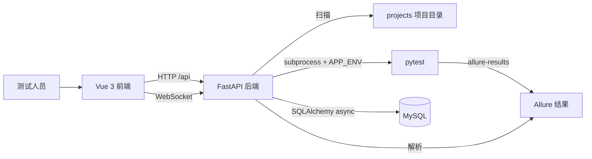
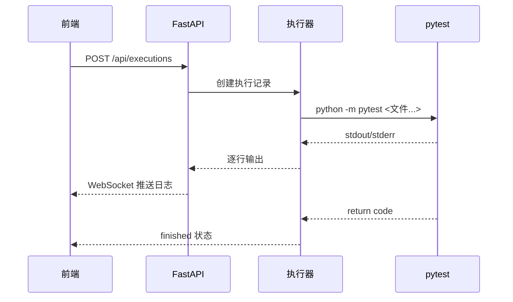

# 测试管理平台技术方案

## 1. 背景与目标

自动化用例已经覆盖多国 WebUI 和巴西接口压测，但执行入口仍依赖 PyCharm 和命令行。本方案新增一个本地测试管理平台，让不写代码的测试人员也能完成三个动作:

1. 查询项目、环境、用例和数据驱动参数
2. 选择项目、环境、用例并触发执行，实时查看日志
3. 查看 Allure 执行结果、通过率和失败用例明细

平台定位是“测试工作台”，不是 CI 调度中心。批量调度、远程执行、权限控制属于后续演进。

## 2. 总体架构



## 3. 技术选型

| 层级 | 选型 | 说明 |
| --- | --- | --- |
| 前端 | Vue 3 + TypeScript + Vite | 组合式 API，构建快，类型清晰 |
| UI | Element Plus | 中文生态好，表格、表单、弹窗等后台组件齐全 |
| 状态 | Pinia | 管理项目列表、环境选择等跨页面状态 |
| 图表 | ECharts | 报告通过率、结果分布可视化 |
| 后端 | FastAPI | 原生异步，自动生成 `/docs` 接口文档 |
| 实时日志 | WebSocket | pytest 输出逐行推送 |
| 执行引擎 | pytest subprocess | 不侵入现有用例，保留原有运行方式 |
| 报告 | allure-results JSON | 直接解析现有结果，避免重复生成报告 |
| 元数据库 | MySQL 8.4 | 持久化项目、用例缓存、执行记录、报告快照 |
| 数据持久化 | 项目本地 bind mount + mysqldump | `data/mysql/` 存数据文件，`data/backups/` 存备份 |

## 4. 目录结构

```text
server/                    后端服务
├── main.py                FastAPI 入口
├── routers/               API 路由
│   ├── projects.py        项目列表与详情
│   ├── cases.py           用例扫描与数据驱动参数
│   ├── executions.py      测试执行与实时进度
│   └── reports.py         报告查询
└── services/
    ├── scanner.py         projects 目录扫描
    ├── runner.py          pytest 子进程执行器
    └── allure_parser.py   Allure 结果解析

frontend/                  前端工作台
├── src/api/               HTTP API 封装
├── src/stores/            Pinia 状态
├── src/views/             首页、用例、执行、报告
└── src/router/            页面路由
```

## 5. 核心流程

### 5.1 项目扫描

1. 扫描 `projects/` 下的一级目录
2. 跳过 `template`、缓存目录
3. 识别 `pytest.ini` 或 `pyproject.toml`，认定为可执行测试项目
4. 从 README 提取描述，从 `config/envs/*.yaml` 提取环境
5. 统计 `testcase/**/test_*.py` 文件数

### 5.2 用例查询

1. 遍历项目 `testcase/` 下的 Python 测试文件
2. 使用正则提取 `test_*` 函数、docstring、pytest marker
3. 读取 `data/{env}/*.yaml`，识别数据驱动参数
4. 返回用例 ID、文件、描述、标签、数据驱动信息

### 5.3 测试执行



执行时通过子进程环境变量 `APP_ENV` 选择 test/UAT/JMSBR 等环境，不改变现有项目的数据隔离约定。

### 5.4 报告查询

平台直接读取 `projects/{project}/allure-results/*.json`，统计通过、失败、异常、跳过。此阶段不复制 Allure 静态服务，避免报告路径漂移；页面展示结构化统计与明细。

## 6. 运行方式

### 6.1 安装依赖

```powershell
# 后端依赖
..\.venv\Scripts\python.exe -m pip install -r server/requirements.txt

# 前端依赖
cd frontend
npm install
```

### 6.2 启动服务

```powershell
# 本地 MySQL（默认 tester/testerpw@127.0.0.1:3306/automation）
docker compose -f docker/docker-compose.yml up -d mysql

# 终端 1: 后端
powershell -ExecutionPolicy Bypass -File scripts/start_backend.ps1

# 终端 2: 前端
powershell -ExecutionPolicy Bypass -File scripts/start_frontend.ps1
```

或使用一键启动脚本（MySQL + 后端 + 前端，单终端）：

```powershell
powershell -ExecutionPolicy Bypass -File scripts/start_all.ps1
```

脚本会自动加载/导出 MySQL 离线镜像、启动容器并等待健康检查、启动后端并轮询 `/api/health`、启动前端 Vite。脚本头部强制 `chcp 65001` + UTF-8 输出，避免 Windows PowerShell 5.1 默认 GBK 解析中文 Write-Host 字符串导致的乱码与语法错误。

访问地址:

| 服务 | 地址 |
| --- | --- |
| 前端工作台 | http://localhost:5173 |
| 后端接口文档 | http://localhost:8900/docs |

后端通过 `APP_DATABASE_URL` 读取数据库连接；`.env.example` 提供本地 Docker MySQL 默认值。项目与用例仍以文件扫描为事实来源，扫描结果同步到数据库；执行记录与报告快照落库，服务重启后页面历史仍可查询。MySQL 数据目录挂载到 `data/mysql/`，逻辑备份写入 `data/backups/`，离线镜像导出到 `data/docker-images/`。

## 7. 约束与风险

| 项 | 当前处理 | 后续演进 |
| --- | --- | --- |
| 执行记录 | MySQL `executions` 表持久化 | 按执行目录隔离 allure-results，避免混写 |
| 并发执行 | 同一项目建议串行，避免 allure-results 混写 | 执行目录按 execution_id 隔离 |
| 权限 | 本地单人工作台 | 增加登录、角色、审批 |
| 远程执行 | 仅本机 | 执行节点注册与任务分发 |
| WebUI 用例 | 可触发，但需要人工参与验证码时浏览器在服务端弹出 | 独立执行节点 + VNC |

## 8. 验收标准

1. 首页能展示项目数、测试文件数、通过率、最近执行
2. 用例查询支持项目、环境切换和关键字搜索
3. 勾选用例后能通过 pytest 正确执行对应文件
4. 执行日志通过 WebSocket 实时刷新
5. 报告中心能解析 allure-results 并展示状态分布与用例明细
6. 未生成报告时页面显示“暂无数据”，不抛出系统错误
