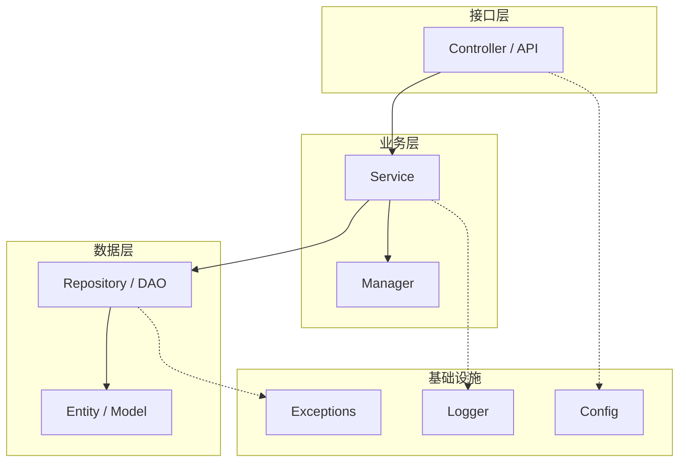
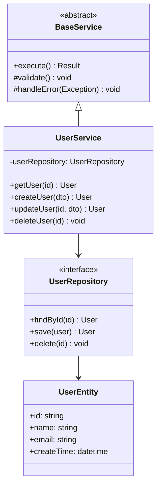
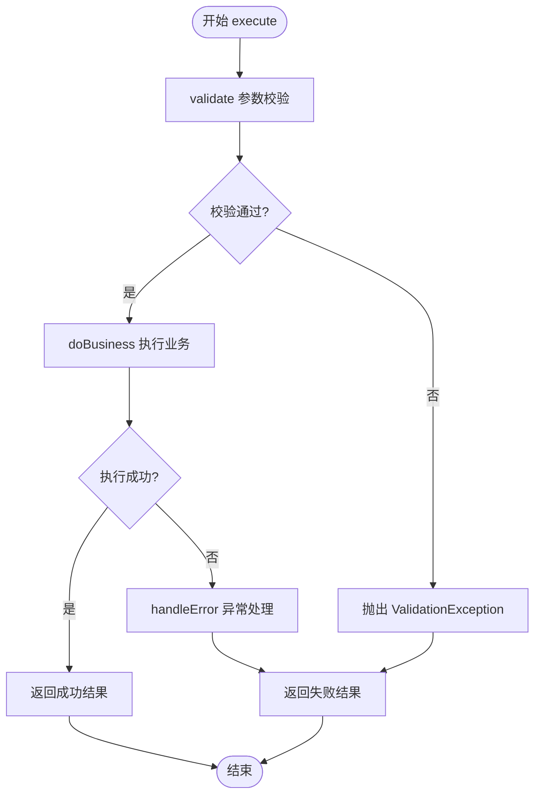
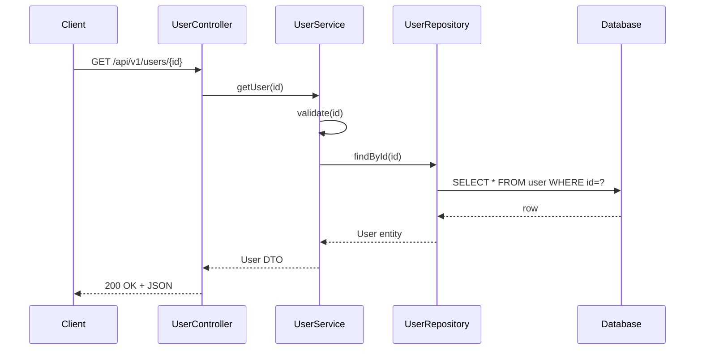
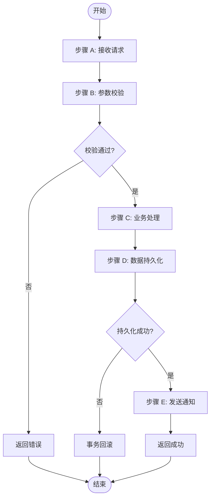
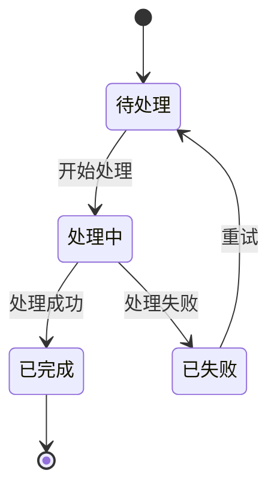
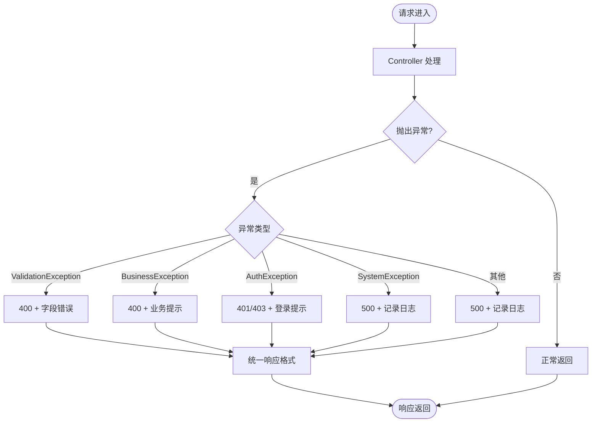
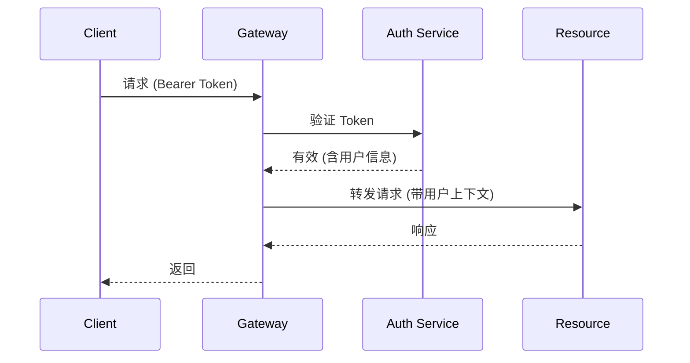

# 详细设计文档模板

> **说明**: 本文件是软件工程规范化的详细设计文档**模板**(含占位符 `______`)。
> 新建业务系统的详细设计文档时, 复制本模板到 `docs/详细设计-<系统名>.md`
> 并填充实际内容, 不要修改本模板文件。
> 已填充实例见 `docs/详细设计文档.md`(测试管理平台后端)。

---

> **文档编号**: DOC-LLD-001
> **版本**: V1.0
> **状态**: [ ] 草稿  [ ] 评审中  [ ] 定稿
> **作者**: ___________
> **日期**: ___________

---

## 文档修订记录

| 版本 | 日期 | 修改人 | 修改内容 |
| --- | --- | --- | --- |
| V1.0 | | | 初稿 |

---

## 1. 引言

### 1.1 编写目的

> **[必有项]** 说明本详细设计文档的编写目的.

本文档基于概要设计文档, 对 ______ 系统进行详细设计, 面向开发工程师.
涵盖类设计、接口实现、核心算法、数据流、异常处理和单元测试设计,
开发人员可据此直接编码实现.

### 1.2 读者对象

开发工程师、测试工程师、代码评审人员.

### 1.3 术语与缩略语

| 术语 | 说明 |
| --- | --- |

### 1.4 参考文档

| 序号 | 文档名称 | 版本 |
| --- | --- | --- |
| 1 | 概要设计文档 | V1.0 |
| 2 | 需求规格说明书 | |

---

## 2. 总体设计

### 2.1 设计概述

> **[必有项]** 简述系统设计思路, 承接概要设计.

### 2.2 包/模块结构

> **[必有项]** 代码包结构树.

```
project-root/
├── module_a/          # 模块 A
│   ├── __init__.py
│   ├── service.py     # 业务逻辑
│   ├── repository.py  # 数据访问
│   └── models.py      # 数据模型
├── module_b/          # 模块 B
│   ├── __init__.py
│   ├── controller.py  # 接口控制层
│   └── dto.py         # 数据传输对象
├── common/            # 公共组件
│   ├── config.py      # 配置
│   ├── logger.py      # 日志
│   └── exceptions.py  # 异常定义
└── tests/             # 测试
```

### 2.3 分层架构图

> **[必有项]** 分层架构图.



---

## 3. 类设计

### 3.1 类图

> **[必有项]** 核心类图, 展示继承/组合/依赖关系.



### 3.2 类详细说明

#### 3.2.1 类: BaseService (抽象基类)

| 项目 | 说明 |
| --- | --- |
| 类名 | BaseService |
| 类型 | 抽象类 |
| 职责 | 所有业务 Service 的基类, 提供模板方法和通用异常处理 |
| 包路径 | `common.service.base_service` |

**方法:**

| 方法签名 | 访问级别 | 参数 | 返回值 | 说明 |
| --- | --- | --- | --- | --- |
| `execute()` | public | 无 | `Result` | 模板方法, 定义执行流程 |
| `validate()` | protected | 无 | `void` | 钩子方法, 子类重写做参数校验 |
| `handleError(exc)` | protected | `Exception` | `void` | 统一异常处理 |

**核心逻辑 -- execute() 方法流程图:**

> **[必有项]** 模板方法流程图.



#### 3.2.2 类: UserService

| 项目 | 说明 |
| --- | --- |
| 类名 | UserService |
| 父类 | BaseService |
| 职责 | 用户增删改查业务逻辑 |
| 依赖 | UserRepository, Logger |

**方法:**

| 方法签名 | 参数 | 返回值 | 说明 |
| --- | --- | --- | --- |
| `getUser(id)` | `id: string` | `User` | 根据 ID 查询用户 |
| `createUser(dto)` | `dto: UserCreateDTO` | `User` | 创建用户 |
| `updateUser(id, dto)` | `id: string, dto: UserUpdateDTO` | `User` | 更新用户信息 |
| `deleteUser(id)` | `id: string` | `void` | 删除用户 |

---

## 4. 接口详细设计

### 4.1 接口清单

> **[必有项]** 所有接口的详细定义.

#### 接口 IF-001: 用户查询

| 项目 | 说明 |
| --- | --- |
| 接口名称 | 用户查询 |
| 请求方式 | GET |
| 请求路径 | `/api/v1/users/{id}` |
| Content-Type | application/json |
| 认证方式 | Bearer Token |

**路径参数:**

| 参数名 | 类型 | 必填 | 说明 |
| --- | --- | --- | --- |
| id | string | 是 | 用户 ID |

**响应:**

| HTTP 状态码 | 说明 | 响应体 |
| --- | --- | --- |
| 200 | 成功 | `{"code": 1, "data": {...}}` |
| 404 | 用户不存在 | `{"code": 0, "msg": "用户不存在"}` |
| 500 | 服务器错误 | `{"code": 0, "msg": "系统异常"}` |

**成功响应示例:**

```json
{
    "code": 1,
    "msg": "请求成功",
    "data": {
        "id": "928995430400790574",
        "name": "张三",
        "email": "zhangsan@example.com",
        "createTime": "2026-08-14 10:00:00"
    }
}
```

**接口调用时序图:**

> **[必有项]** 接口内部调用时序图.



---

## 5. 核心流程详细设计

### 5.1 流程清单

> **[必有项]** 核心业务流程清单.

| 流程编号 | 流程名称 | 涉及模块 | 说明 |
| --- | --- | --- | --- |
| F-001 | | | |
| F-002 | | | |

### 5.2 流程详细设计

#### 5.2.1 流程 F-001: ______

> **[必有项]** 核心流程图.



**步骤说明:**

| 步骤 | 操作 | 输入 | 输出 | 异常处理 |
| --- | --- | --- | --- | --- |
| A | | | | |
| B | | | | |
| C | | | | |
| D | | | | |

**状态流转图:**

> **[必有项]** 如有状态机, 画状态流转图.



---

## 6. 数据结构设计

### 6.1 数据模型

> **[必有项]** 核心数据模型定义.

#### 6.1.1 模型: UserEntity

| 字段名 | 类型 | 约束 | 说明 |
| --- | --- | --- | --- |
| id | string | PK, 非空 | 用户唯一标识 |
| name | string | 非空, 最大 50 | 用户名 |
| email | string | 唯一, 格式校验 | 邮箱 |
| status | enum | 非空 | 状态: ACTIVE/INACTIVE |
| createTime | datetime | 非空 | 创建时间 |
| updateTime | datetime | 非空 | 更新时间 |

### 6.2 DTO 定义

#### 6.2.1 UserCreateDTO

| 字段名 | 类型 | 必填 | 校验规则 | 说明 |
| --- | --- | --- | --- | --- |
| name | string | 是 | 1-50 字符 | 用户名 |
| email | string | 是 | 邮箱格式 | 邮箱 |

### 6.3 枚举定义

| 枚举名 | 值 | 说明 |
| --- | --- | --- |
| UserStatus | ACTIVE | 活跃 |
| UserStatus | INACTIVE | 停用 |

---

## 7. 数据库详细设计

### 7.1 建表语句

> **[必有项]** DDL.

```sql
CREATE TABLE `user` (
    `id`          VARCHAR(32)   NOT NULL COMMENT '用户ID',
    `name`        VARCHAR(50)   NOT NULL COMMENT '用户名',
    `email`       VARCHAR(100)  DEFAULT NULL COMMENT '邮箱',
    `status`      VARCHAR(20)   NOT NULL DEFAULT 'ACTIVE' COMMENT '状态',
    `create_time` DATETIME      NOT NULL DEFAULT CURRENT_TIMESTAMP COMMENT '创建时间',
    `update_time` DATETIME      NOT NULL DEFAULT CURRENT_TIMESTAMP ON UPDATE CURRENT_TIMESTAMP COMMENT '更新时间',
    PRIMARY KEY (`id`),
    UNIQUE KEY `uk_email` (`email`)
) ENGINE=InnoDB DEFAULT CHARSET=utf8mb4 COMMENT='用户表';
```

### 7.2 索引设计

| 索引名 | 字段 | 类型 | 说明 |
| --- | --- | --- | --- |
| PK_id | id | 主键 | |
| uk_email | email | 唯一 | 防止重复邮箱 |
| idx_status | status | 普通 | 按状态查询 |

### 7.3 数据迁移

| 迁移项 | 说明 | 回滚方案 |
| --- | --- | --- |

---

## 8. 异常处理设计

### 8.1 异常分类

> **[必有项]** 异常分类和处理策略.

| 异常类型 | 说明 | HTTP 状态码 | 错误码 | 处理策略 |
| --- | --- | --- | --- | --- |
| ValidationException | 参数校验失败 | 400 | 40001 | 返回字段错误信息 |
| BusinessException | 业务逻辑异常 | 400 | 40xxx | 返回业务错误提示 |
| AuthException | 认证/授权失败 | 401/403 | 401xx | 返回登录提示 |
| SystemException | 系统异常 | 500 | 50000 | 记录日志, 返回通用错误 |

### 8.2 异常处理流程

> **[必有项]** 全局异常处理流程图.



### 8.3 错误码表

> **[必有项]** 完整错误码定义.

| 错误码 | HTTP 状态 | 异常类型 | 错误信息 | 说明 |
| --- | --- | --- | --- | --- |
| 40001 | 400 | Validation | 参数校验失败 | |
| 40002 | 400 | Validation | 必填参数缺失 | |
| 40101 | 401 | Auth | Token 无效 | |
| 40102 | 401 | Auth | Token 过期 | |
| 40301 | 403 | Auth | 无权限访问 | |
| 40401 | 404 | Business | 资源不存在 | |
| 40901 | 409 | Business | 数据冲突 | |
| 50000 | 500 | System | 系统内部错误 | |

---

## 9. 日志设计

### 9.1 日志规范

| 级别 | 使用场景 | 示例 |
| --- | --- | --- |
| DEBUG | 调试信息 | 方法入参/出参, SQL |
| INFO | 关键业务操作 | 用户登录, 订单创建 |
| WARN | 异常但可恢复 | 重试成功, 降级 |
| ERROR | 系统异常 | 空指针, DB 连接失败 |

### 9.2 日志格式

```
[时间] [级别] [TraceId] [类名.方法名] - 消息
```

### 9.3 关键日志埋点

| 业务场景 | 日志级别 | 日志内容 | 是否记录入参 |
| --- | --- | --- | --- |
| 接口请求 | INFO | 请求路径, 耗时, 状态码 | 是 |
| 业务异常 | WARN | 异常类型, 消息 | 是 |
| 系统异常 | ERROR | 堆栈信息 | 是 |

---

## 10. 单元测试设计

### 10.1 测试策略

> **[必有项]** 测试分层策略.

| 层次 | 范围 | 工具 | 覆盖率目标 |
| --- | --- | --- | --- |
| 单元测试 | 单个类/方法 | pytest / JUnit | > 80% |
| 集成测试 | 模块间协作 | pytest + testcontainers | 关链路 100% |
| 接口测试 | API 级别 | httpx / RestAssured | 核心接口 100% |

### 10.2 测试用例

> **[必有项]** 核心测试用例.

#### 10.2.1 UserService.getUser

| 用例编号 | 场景 | 输入 | 预期结果 | 前置条件 |
| --- | --- | --- | --- | --- |
| TC-001 | 正常查询 | id="123" | 返回 User 对象 | 数据库存在该用户 |
| TC-002 | 用户不存在 | id="999" | 抛出 NotFoundException | 数据库不存在该用户 |
| TC-003 | ID 为空 | id="" | 抛出 ValidationException | - |
| TC-004 | ID 格式错误 | id="abc" | 抛出 ValidationException | - |

#### 10.2.2 UserService.createUser

| 用例编号 | 场景 | 输入 | 预期结果 | 前置条件 |
| --- | --- | --- | --- | --- |
| TC-005 | 正常创建 | 合法 DTO | 返回 User, 含 ID | 邮箱不重复 |
| TC-006 | 邮箱重复 | 已存在邮箱 | 抛出 ConflictException | 邮箱已存在 |
| TC-007 | 名称为空 | name="" | 抛出 ValidationException | - |

---

## 11. 配置设计

### 11.1 配置项清单

> **[必有项]** 可配置参数.

| 配置项 | 环境变量 | 默认值 | 说明 | 环境 |
| --- | --- | --- | --- | --- |
| 数据库地址 | DB_HOST | localhost | | 全部 |
| 数据库端口 | DB_PORT | 3306 | | 全部 |
| Redis 地址 | REDIS_HOST | localhost | | 全部 |
| 日志级别 | LOG_LEVEL | INFO | DEBUG/INFO/WARN/ERROR | 全部 |
| 限流阈值 | RATE_LIMIT | 1000 | 每秒最大请求数 | PROD |

### 11.2 环境差异配置

| 配置项 | DEV | TEST | UAT | PROD |
| --- | --- | --- | --- | --- |
| DB_HOST | localhost | test-db | uat-db | prod-db |
| LOG_LEVEL | DEBUG | INFO | INFO | WARN |
| RATE_LIMIT | 无限制 | 500 | 1000 | 2000 |

---

## 12. 安全设计

### 12.1 认证与授权

> **[必有项]** 认证授权流程.



### 12.2 数据安全

| 安全维度 | 设计方案 |
| --- | --- |
| 传输加密 | HTTPS (TLS 1.2+) |
| 密码存储 | bcrypt 加盐哈希 |
| 敏感数据 | AES-256 加密存储 |
| 日志脱敏 | 手机号/邮箱/身份证脱敏 |

---

## 附录

### A. 必有项检查清单

| 序号 | 检查项 | 是否完成 |
| --- | --- | --- |
| 1 | 包/模块结构树 | [ ] |
| 2 | 分层架构图 | [ ] |
| 3 | 类图 | [ ] |
| 4 | 类详细说明 (方法/参数/返回值) | [ ] |
| 5 | 核心方法流程图 | [ ] |
| 6 | 接口清单 | [ ] |
| 7 | 接口参数/响应/状态码 | [ ] |
| 8 | 接口调用时序图 | [ ] |
| 9 | 核心流程图 | [ ] |
| 10 | 状态流转图 (如有) | [ ] |
| 11 | 数据模型定义 | [ ] |
| 12 | 建表 DDL | [ ] |
| 13 | 索引设计 | [ ] |
| 14 | 异常分类表 | [ ] |
| 15 | 异常处理流程图 | [ ] |
| 16 | 错误码表 | [ ] |
| 17 | 日志规范 | [ ] |
| 18 | 单元测试用例 | [ ] |
| 19 | 配置项清单 | [ ] |
| 20 | 认证授权时序图 | [ ] |

### B. 图表索引

| 图表编号 | 名称 | 类型 | 位置 |
| --- | --- | --- | --- |
| 图 1 | 分层架构图 | 架构图 | 2.3 |
| 图 2 | 类图 | 类图 | 3.1 |
| 图 3 | execute() 流程图 | 流程图 | 3.2.1 |
| 图 4 | 接口时序图 | 时序图 | 4.1 |
| 图 5 | 核心流程图 | 流程图 | 5.2.1 |
| 图 6 | 状态流转图 | 状态图 | 5.2.1 |
| 图 7 | 异常处理流程图 | 流程图 | 8.2 |
| 图 8 | 认证授权时序图 | 时序图 | 12.1 |
